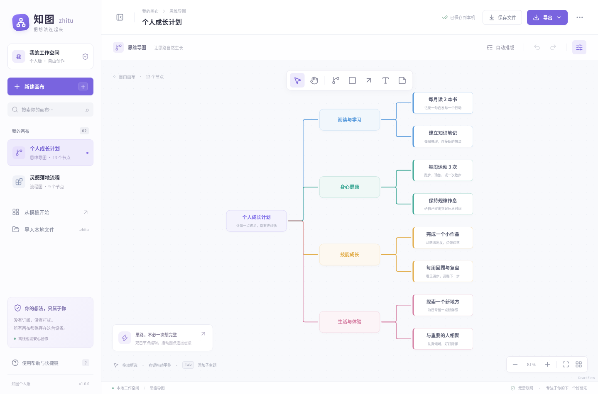

# 知图 ZhiTu

用于个人创作的离线流程图与思维导图桌面软件，面向 **Windows 10 / 11 x64**。无需注册账号、无需订阅，文档保存在本机。

知图参考常见白板软件的操作习惯，采用自主实现的界面和代码，与 Boardmix 没有隶属关系。它适合个人整理想法、梳理流程，不支持团队协作、云同步或 Boardmix 专有格式文件。



[查看流程图界面](docs/screenshots/flowchart.png)

## 使用

构建完成后，`release/` 中会生成两种 Windows 免安装版本：

- **`ZhiTu-1.0.0-Windows-Portable.exe`**：单文件免安装版，双击启动；首次启动会先解压运行文件，需稍等片刻。
- **`ZhiTu-1.0.0-Windows-x64.zip`**：免安装版，先完整解压，再运行其中的 `ZhiTu.exe`，请保留解压目录中的其他文件。

如果当前目录没有安装包，可按下方步骤自行构建。当前没有代码签名，Windows 可能提示发布者未知，请确认文件来自本项目的构建产物。Windows 实机安装和运行仍需验证。

### 画流程图与思维导图

- 创建画布，选择流程图或思维导图模板开始编辑。
- 在流程图中添加节点，编辑文字，拖动节点调整位置，通过节点连接点创建连线。
- 选中节点后可以拖动角点调整大小，右侧面板可以修改文字、形状和颜色。选中连线后可以添加“是 / 否”等说明。
- 在思维导图中选中主题后，按 `Tab` 添加子主题，按 `Enter` 添加同级主题。
- 使用画布缩放、拖动和适应画布操作查看内容。
- 导出 `.zhitu` 文档保留可编辑内容；导出 SVG 或 PNG 用于分享和插入其他文档。

### 保存与备份

编辑内容会自动保存在当前设备的应用存储中。自动保存不是云备份，也不会自动更新你之前导出的 `.zhitu` 文件。建议定期按 `Ctrl+S`，把最新的 `.zhitu` 文档保存到自己的文件夹。

按 `Ctrl+O` 可以导入知图的 `.zhitu` 文档，也可以导入具有相同数据结构的 `.json` 文档。应用不会转换其他软件的任意 JSON 或 Boardmix 专有文件。

桌面版本与浏览器开发版本使用各自的本地存储；在不同设备、不同用户账户间迁移时，请使用 `.zhitu` 文件。清理应用数据可能删除自动保存的画布。

### 快捷键

| 快捷键         | 操作                           |
| -------------- | ------------------------------ |
| `Ctrl+S`       | 将当前画布保存为 `.zhitu` 文档 |
| `Ctrl+O`       | 导入知图文档                   |
| `Ctrl+Z`       | 撤销                           |
| `Ctrl+Shift+Z` | 重做                           |
| `Delete`       | 删除选中的节点                 |
| `Tab`          | 在思维导图中添加子主题         |
| `Enter`        | 在思维导图中添加同级主题       |
| `F11`          | 切换桌面窗口全屏               |

编辑文字时，撤销等文字编辑快捷键优先；`Ctrl+S` 和 `Ctrl+O` 仍用于保存与导入画布。

## 开发

技术栈为 React、TypeScript、Vite、React Flow 和 Electron。建议使用 Node.js 22 LTS 与 npm，首次安装和构建需要联网下载依赖，日常使用桌面软件不需要联网。

```sh
npm ci
npm run dev
```

打开终端显示的本地地址即可调试界面。启动桌面版本：

```sh
npm run desktop
```

该命令先构建前端，再运行 Electron。Electron 默认加载 `dist/index.html`；需要连接已启动的 Vite 开发服务时，可以向 `electron .` 提供 `VITE_DEV_SERVER_URL` 环境变量。打包后的软件始终使用本地文件。

### 检查

```sh
npm run build
npm test
```

`build` 执行 TypeScript 检查和前端生产构建，`test` 执行自动化测试。浏览器端交互测试可单独运行：

```sh
npx playwright install chromium
npm run test:e2e
```

首次运行 Playwright 需要下载浏览器；Linux 机器还可能需要安装浏览器系统依赖。自动化检查不能替代 Windows 实机安装、文件对话框和桌面交互验证。

### 打包 Windows 版本

```sh
npm ci
npm run dist:win
```

产物输出到 `release/`。当前默认生成 x64 单文件免安装 EXE 和 ZIP，不启用代码签名。Linux 交叉构建跳过 Windows 可执行文件的资源编辑，免安装目标不依赖 Wine。

如果需要安装向导，在 Windows 上运行 `npm run dist:win:installer`，生成 `ZhiTu-1.0.0-Windows-Setup.exe`。从 Linux 交叉构建 NSIS 安装向导需要额外配置 Wine；默认免安装版无需它。

也可以在代码推送到 GitHub 后打开仓库的 **Actions → Build Windows → Run workflow**。该手动工作流会在 Windows runner 上安装依赖、检查构建、运行测试并打包。完成后，在该次运行的 **Artifacts** 中下载 `ZhiTu-Windows-x64`。工作流只上传构建产物，不自动发布 GitHub Release。

Linux 开发环境可用 `npm run dist:linux` 生成用于检查的未安装应用目录。Windows 是当前目标平台。

## 本地数据与安全边界

应用不配置账号系统、协作服务器或云同步。Electron 开启上下文隔离和渲染进程沙箱，界面仅能通过指定接口打开文件选择器、读取所选文档或保存文件，不具有通用文件系统访问接口。

本地最多保存 100 个画布，编辑器新增节点上限为每个画布 500 个、连线 3000 条；导入文件最多支持 1000 个节点。可编辑文档上限为 2 MiB；图片保存上限为 64 MiB。大型画布建议拆分。PNG 导出会按最长边 16384 像素、总计 3200 万像素自动调整分辨率。

读取本地数据时会逐个检查画布。遇到损坏记录，先保留原始数据备份并恢复其他有效画布；如果备份失败，则明确暂停自动保存，避免覆盖原记录。

## 许可

项目代码采用 [MIT License](LICENSE)。第三方依赖遵循各自的许可证。
